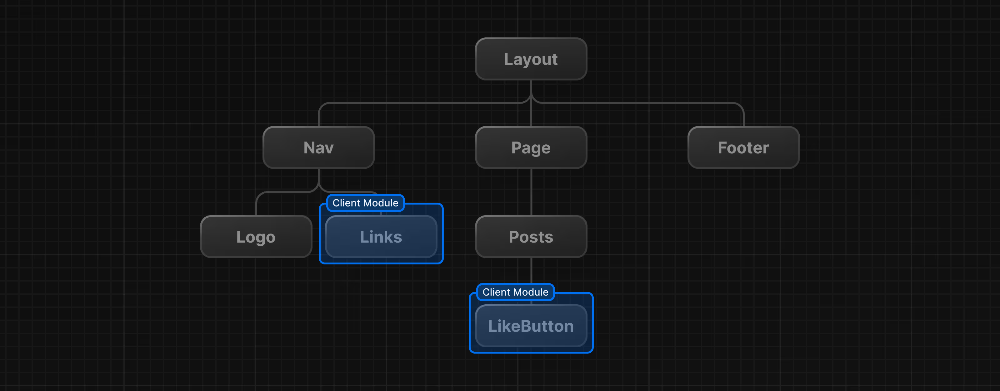

#Route groups 

if you name a folder with "(name)" in folders , then you don't need to write this as route in the url. this is ignored as route in routing. 
So you this feature when you want to group routes in a folder but don't want that folder as route name in the url 
eg : (auth)
       |
       -----> signin 
       |
       -----> signup 
so now you don't need to write : auth/signin or auth/signup 
you can directly write : /signup and /signin 

#Layout.tsx 

This file is used to wrap all the file or route in that particular root / parent folder to be a similar route . So wrap all the children in root / parent folder in layout.tsx 

#Dynamic Routes 

In this you name a folder with "[slug]" , by this , you can dynamically change page for diff slug and writing the same code with page.tsx and then by taking slug from the param you can render things dynamically.

In Next.js, dynamic routes allow you to create pages that change based on the URL. You can do this by naming a folder [slug], which acts as a placeholder for different values. Inside page.tsx, you can access the slug from params and use it to dynamically display content without writing multiple pages

#Catch-all segment [...slug] 

so this is used to catch all the slug after the route , for eg if i make a route courseId/[...segment] 
then in the url whatever i write after the courseId , if will catch all of them and give an array of all of them 

and if you make it [[...slug]]
then it would render for /courseId as well , so we don't need to make another page.tsx for /courseId 

but better approach is to make another page.tsx 

#Static Site Generation : 

In this we generate some page into html which does need server side render and can be deliverd by static page directly . 
in this When we build the project , Nextjs automatically genrate the static pages
static page generate : making them into html page and directly deliverd when required 

this is what is looks when we build the project and get as an output : 

Acer@LAPTOP-JEN39SDR MINGW64 /d/WEB DEV/Nextjs/nextjs_advance (main)
$ pnpm build 

> nextjs_advance@0.1.0 build D:\WEB DEV\Nextjs\nextjs_advance
> next build

   ▲ Next.js 15.2.3

   Creating an optimized production build ...
 ✓ Compiled successfully
 ✓ Linting and checking validity of types    
 ✓ Collecting page data    
 ✓ Generating static pages (7/7)
 ✓ Collecting build traces    
 ✓ Finalizing page optimization

Route (app)                                 Size  First Load JS
┌ ○ /                                      150 B         101 kB
├ ○ /_not-found                            977 B         101 kB
├ ƒ /blog/[blogId]                         150 B         101 kB
├ ƒ /courses/[...folderIds]                150 B         101 kB
├ ○ /signin                                150 B         101 kB
└ ○ /signup                                150 B         101 kB
+ First Load JS shared by all             101 kB
  ├ chunks/4bd1b696-5b6c0ccbd3c0c9ab.js  53.2 kB
  ├ chunks/684-c0c78eab0c9b2e63.js       45.3 kB
  └ other shared chunks (total)          1.95 kB

where all the pages with dot are now statically generated automatically.

SSR : Server Side Rendering 
CSR : Client side Rendering  
SSG : Static site generation

in client side generation , it is also rendered server side , but the component which need to be render on client are only render on the client side  

please refer this link for the more clearity : [Server and client side rendering](https://nextjs.org/learn/react-foundations/server-and-client-components)
